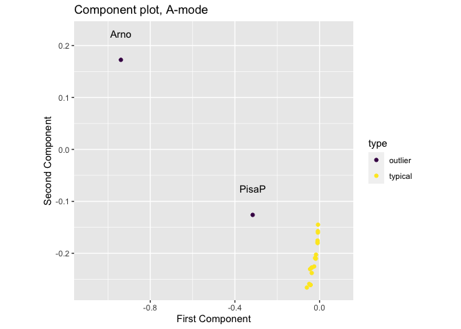
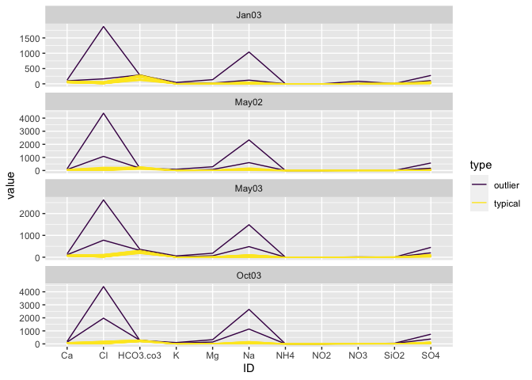

<!-- README.md is generated from README.Rmd. Please edit that file -->

# mask 

<!-- badges: start -->

[](https://www.repostatus.org/#wip)
[](https://www.gnu.org/licenses/old-licenses/gpl-2.0.html)

[](https://travis-ci.org/pridiltal/mask)
<!-- badges: end -->

The goal of mask is to provide a framework to detect spatial anomalies
in multivariate spatio-temporal data (tensor data, multiway data). An
anomaly is a spatial point or region that deviates significantly from
the global and/or local distribution of a given network

## Installation

You can install mask from github with:

``` r
# install.packages("devtools")
devtools::install_github("pridiltal/mask")
```

## Example

This is a basic example which shows you how to solve a common problem:

``` r
library(mask)
library(rrcov3way)
data(Arno)

result <- find_spatial_outlier(data = Arno, center.mode = "B", scale.mode = "B", tensor_decom = "Tucker3")
p <- plot_spatial_outliers(X = result$out_data)
p + viridis::scale_color_viridis(discrete = TRUE) +
  ggplot2::xlim(-1.1, 0.1)
```



``` r
library(tidyverse)
library(purrr)
data <- purrr::array_tree(Arno, 3) %>%
  combine() %>%
  as_tibble() %>%
  setNames(., colnames(Arno)) %>%
  mutate(
    site = rep(rownames(Arno), dim(Arno)[3]),
    time = rep(dimnames(Arno)[[3]], each = dim(Arno)[1]),
    type = rep(result$out_data$type, dim(Arno)[3])
  ) %>%
  pivot_longer(1:11, names_to = "ID")

p <- data %>% ggplot(aes(x = ID, y = value, colour = type, group = site)) +
  geom_line() +
  facet_wrap(~time, ncol = 1, scales = "free_y") +
  scale_color_viridis_d()

print(p)
```


